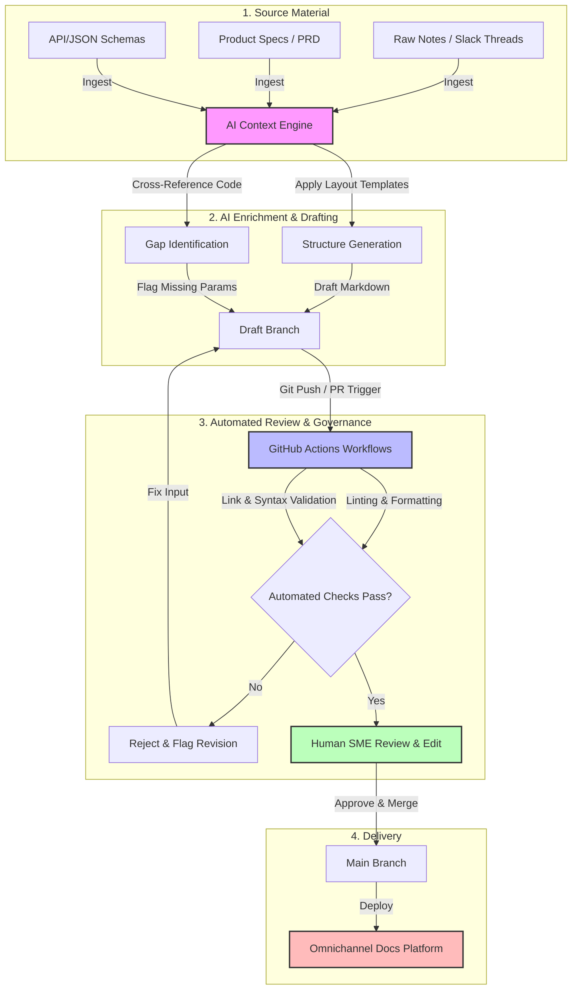

# Surviving the "AI Mandate": A Practical Framework for Technical Writers

When management announces, **"We need to find ways to use AI for our docs,"** it usually triggers a mix of panic, eye-rolling, and desperate prompt-stuffing. The immediate temptation is to try to auto-generate entire user manuals from scratch, resulting in generic, adjective-heavy fluff that nobody wants to read. 

Instead of forcing artificial intelligence into roles it cannot handle, a modern **Docs-as-Code** workflow treats AI as a highly specialized assistant. By focusing on workflow efficiency rather than replacing human technical judgment, you can deliver high-value, structured documentation that remains technically accurate.

Here is a practical framework for shifting from an ambiguous AI mandate to engineering actual strategic value in your repository.

## The AI-Assisted Docs Pipeline

To safely leverage AI without sacrificing technical accuracy, content ingestion, enrichment, and validation must follow a structured pipeline before reaching production.

## Operationalizing AI in Docs-as-Code
Rather than treating AI as a magical content generator, embed it into specific, isolated points of your existing CI/CD or authoring workflow.

### 1. Structure Over Style (Outlining & Ingestion)
AI excels at pattern recognition, not original technical reasoning. Use it to ingest unstructured data and format it into clean markdown schemas.
* **The Workflow:** Feed an AI engine your raw engineering notes, Slack threads, or a chaotic product spec.
* **The Prompt Goal:** Instruct it to output a logical tutorial outline or a standard system architecture blueprint based on pre-defined templates.

### 2. Identifying Documentation Gaps
Human writers excel at explaining *how* to use a feature, but they frequently miss hidden code changes. AI can bridge this gap by auditing files.
* **The Workflow:** Run automated checks that compare code signatures, API responses, or JSON schemas against your existing Markdown files.
* **The Prompt Goal:** Identify missing request parameters, undocumented edge cases, or deprecated error codes before they hit production.

### 3. Accelerated Glossary & Definitions
Drafting definitions for industry-standard terminology is essential for content discoverability, but it is notoriously tedious.
* **The Workflow:** Provide a list of technical terms or specialized acronyms from your codebase.
* **The Prompt Goal:** Offload the first-pass taxonomy generation and standard definitions to AI, allowing you to focus entirely on editing for your team's authentic voice.

## Core Rules for AI Governance

To keep your documentation reliable, enforce a strict separation between machine-assisted drafting and human-verified publishing:

* **Never Publish Raw Output:** Treat every AI response as an unverified rough draft. It always requires a technical writer's editorial oversight and subject-matter expert (SME) validation.
* **Automate the Linting:** Integrate automated quality checks into your GitHub Actions. Build workflows to lint Markdown files for forbidden corporate jargon, hallucinated syntax, and broken links before any branch is merged.
* **Inject Real-World Context:** True documentation value lives in edge cases, specific trade-offs, and troubleshooting guides -nuances that AI cannot predict without human intervention.

## Strategic Value
By pivoting from a "hype-first" AI strategy to a **technical workflow framework**, you transform a vague corporate mandate into a measurable engineering win. You reduce time-to-first-draft, catch compliance gaps earlier in the development lifecycle, and ensure your team's time is spent on complex architecture visualization rather than repetitive drafting.
